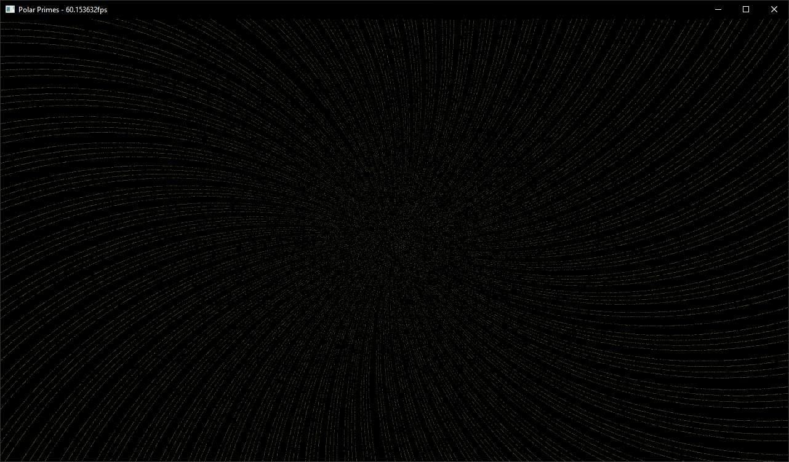

# Polar Primes

Polar Primes is a program that plots prime numbers in polar coordinates. The inspiration for this program came from a 3Blue1Brown [video](https://www.youtube.com/watch?v=EK32jo7i5LQ) however I wanted to see what it looked like if you zoomed out further.

## Usage
### Prime Number Count
By default, when you run the program, it will generate the first one million prime numbers. If this does not work, you can modify then number of prime numbers to generate with the first command line argument. For example `Polar-Primes 100000` would generate the first one hundred thousand primes.

With 16GB of ram you can display just under one billion prime numbers dependent (OpenGL implementation dependent).

### Controls
Once the prime number calculator has generated the desired number of primes a new window will open to display them in polar coordinates. In this window you can scroll the mouse wheel to zoom in and out.

## Installation
The program can be accessed in the GitHub releases page simply navigate to the latest release, download the zip file for your platform, extract it and run the executable.

Alternatively, the program can be compiled from scratch using CMake. The program is designed for g++ on Windows but should also work with Visual Studio (MSVC) on Windows and g++ on Linux. I have not tested the program using any other build systems. All dependencies should be in this repository or automatically download by CMake.

## Credit
Portions of this software (especially the Shader object) are modified versions of the code provided on https://learnopengl.com which is licenced under the CC BY 4.0 license available [here](https://creativecommons.org/licenses/by/4.0/legalcode) not the MIT licence of the rest of the software.